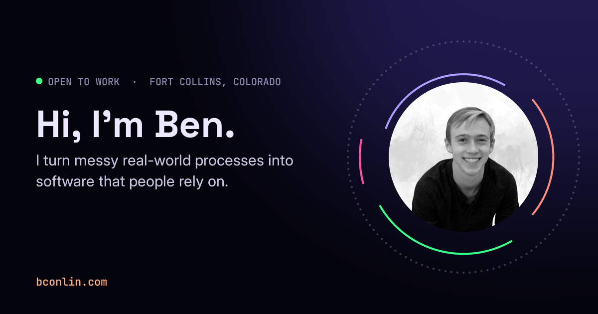

# bconlin.com

My portfolio: a career told as four illustrated chapters, a résumé that re-ranks itself for the role you're hiring for, the projects I build outside of work, and a few secrets. Every page has a **Behind the scenes** switch that shows the real code running the part you're looking at.

**Live:** [bconlin.com](https://bconlin.com)



## What's on it

| Page | What it does |
| --- | --- |
| **Home** (`index.html`) | 400 points race between shapes laid out down the page: rings round my portrait, a timeline, four charts, a set of strings you can strum. The browser tab's icon is a live 32-pixel copy of them. |
| **Career** (`career.html`) | Four chapters on a scroll-driven timeline, each a different kind of scene: a parallax painting of Houghton in winter, a law firm's paperwork sorting itself into systems, a surgical department simulated person by person, and an AI coaching app checking its own plans. |
| **Résumé** (`resume.html`) | Every line comes from a bank of my real bullets, scored 0 to 10 for each kind of role. Pick a focus and the page re-ranks itself, trims to one page, and slides the lines into their new places. |
| **Projects** (`projects.html`) | A skills grid that is also the filter. Every dot is backed by a specific bullet or tool, and the filtered view lives in the URL so it can be shared. Two projects run live in the page (WebGPU and WebAssembly). |
| **Secrets** (`eggs.html`) | Twenty hidden interactions across the site, a star chart of the ones you've found, and the code behind each. |

## How it's built

**No framework.** Plain JavaScript modules, CSS, SVG, Canvas 2D and the Web Audio API. The only dependency is [Vite](https://vite.dev), for the dev server and the build. The site is mostly one-off animation and drawing, which a component framework wouldn't help with, and keeping it plain means the code the inspector shows is exactly the code that runs.

**A multi-page site.** Each page is its own HTML file and entry point (`vite.config.js`), sharing modules for the header, the menu, sound, secrets and the inspector. Assets are built with relative paths, so the site works from any folder.

**Deployed from `main`.** Every push to `main` builds with Vite and publishes `dist/` to GitHub Pages through GitHub Actions (`.github/workflows/deploy.yml`).

### The systems

**Scroll scenes** (`src/engine/`). Each career chapter is a tall section with a sticky stage. `createDirector()` turns scroll position into a 0 to 1 progress per scene, eased so motion feels weighted rather than locked to the wheel. Scenes split their progress into beats. A `conductor` plays each beat change as one timed move that always finishes, sped up if you scroll ahead and reversed in place if you scroll back. `glideTo()` jumps play *through* the scenes in between on an ease-in-out curve.

**The four chapters** (`src/scenes/`)
- *Michigan Tech*: a 1600 × 900 painting in eight planes (six SVG, two canvas). Parallax offsets are linear in each plane's depth, and the canal is a ground plane moved by an affine shear (`planeMatrix`), so it stays glued to the lake. Live canvas aurora and snow are driven by value noise and fractal Brownian motion. Everything is seeded (Park–Miller), so the town looks the same every visit.
- *Business Law Group*: 48 documents choreographed by pure functions (`choreo.js`). They're routed by rule or classifier confidence, reconciled to a ledger by greedy date-distance matching, and laid out as bins, bar charts and intranet tiles. Sketches show row-level security (role-scoped SQL) and a TF-IDF search index.
- *UCHealth*: the perioperative department as an agent-based simulation. Each patient, nurse, surgeon, anesthesiologist and OR is a generator coroutine that yields "wait until…" conditions. Everyone moves at once without colliding thanks to windowed hierarchical cooperative A* (space-time search against a shared reservation table). The bedside monitor draws a synthetic ECG built from Gaussian bumps (the McSharry model) with respiratory sinus arrhythmia.
- *Chaos Coaching*: the app's screens rebuilt with sample data, and a sketch of its guardrails: Claude proposes a training week, and plain code decides whether it can be saved.

**The home field** (`src/home/field.js`). 400 points on one fixed canvas. Each frame they find the structure nearest the middle of the window and race to it. Each point is a damped spring toward its slot. While they form strings, each point is also pulled toward its two neighbors (a discretized wave equation), so a flick of the cursor travels along the string. Crossing a string plucks it.

**Sound** (`src/site/sound.js`, `src/career/soundscape.js`). Everything is synthesized; there are no audio files. Plucked strings use Karplus–Strong (a noise burst through a delay line with an averaging filter). There's a pad on each section's chord through a slowly breathing low-pass filter, and a convolution reverb whose impulse response is generated decaying noise. All of it is in A major, so any two sounds agree. Each career chapter has its own atmosphere and its own small sounds. Sound stays off until you turn it on.

**Behind the scenes** (`src/inspect/`). The inspector imports each module's source verbatim with Vite's `?raw`. `extract()` pulls out one named function (with its doc comment) using a small scanner that skips strings, template literals and comments, and `highlight()` colors it. Each topic pairs that code with a live visualization and live values from the running page. Code that isn't mine to show (the law firm's, Chaos Coaching's) appears only as clearly labeled sketches written for the site.

**Secrets** (`src/site/eggs.js`, `src/secrets/`). A registry of every secret with a hint and a spoiler. Progress lives only in `localStorage` and syncs across tabs through the `storage` event. Secrets are interactions, not pop-ups:
- Scroll up past the top of the home page into a log-scale sky up to the Moon.
- Dive the canal on the career page.
- Fold a paper crane whose folds are real reflections across crane creases (`fold.js`).
- Leave a page alone and it fills with a fish tank.

**The résumé engine** (`src/resume/`). Each bullet is one fact with any number of wordings. `compose()` ranks facts for a focus and trims the weakest until the page fits. `rankWordings()` picks the wording on substance: the job's keywords first (applicant tracking systems match words literally), then the fewest problems (a dropped number, a banned word), then the most numbers. I edit the bank in a private studio that isn't in this repo; `vite.config.js` loads it on my machine if it's there, and the site builds the same without it.

**Link previews** (`tools/og.py`). Share images are drawn with Pillow in the site's own fonts and colors. Each page carries Open Graph and Twitter card tags.

## Principles

- **Real facts only.** Every number and story comes from my résumés or from me. Illustrations of employers' systems are labeled as sketches, with invented data.
- **Simple visuals that teach the gist.** Stylized, high-contrast and readable over lifelike.
- **Accessible.** Everything honors `prefers-reduced-motion`, controls work from the keyboard, and sound is opt-in.
- **Cheap to run.** Animations stay on `transform` and `opacity` where possible. Scenes only update while they're near the screen, and the inspector only draws while it's open.

## Run it

```bash
npm install
npm run dev       # http://localhost:5173
npm run build     # into dist/
npm run preview   # serve the build
```

Share images: `python tools/og.py` (needs Pillow; it fetches the fonts the first time).

## Layout

```
index.html career.html resume.html projects.html eggs.html   one entry per page
src/
  engine/              scroll director, beat conductor, card deck, math
  scenes/              the four career chapters (houghton, blg, uch, chaos)
  art/                 seeded SVG toolkit, value noise, aurora, snow
  home/                the 400-point field, its structures, the live favicon
  resume/              the bank, composing a page, wordings, line fit
  projects/            project data and the skills grid
  inspect/             Behind the scenes: inspector, source extraction, topics
  site/                header menu, sound, secrets registry, console API, margin rain
  secrets/             each secret's interaction
  styles/              one stylesheet per page, plus shared base and blueprint
tools/                 share images (og.py)
public/                photos, project screenshots, live demos, share images, the résumé PDF
```

## Contact

[benaconlin@gmail.com](mailto:benaconlin@gmail.com) · [LinkedIn](https://www.linkedin.com/in/benconlin/)
